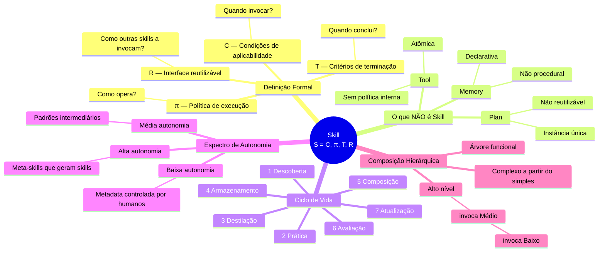
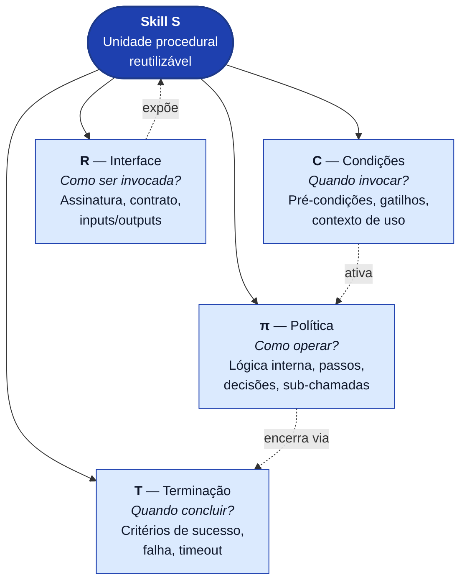
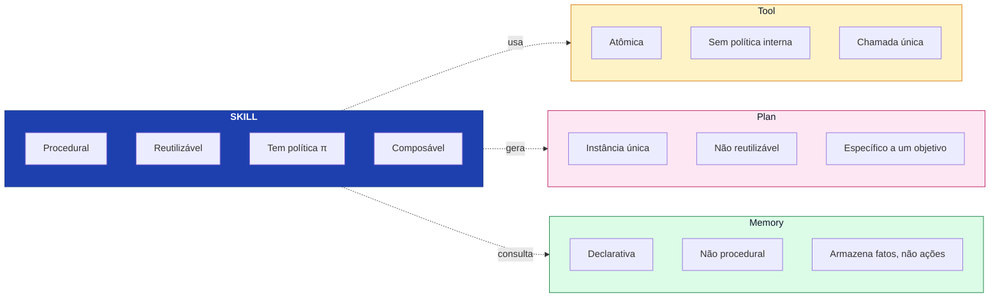
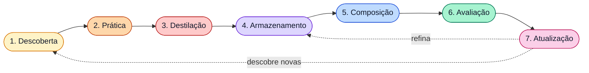
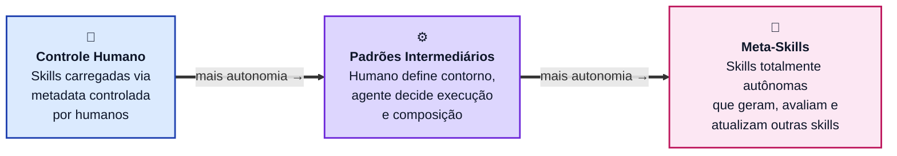
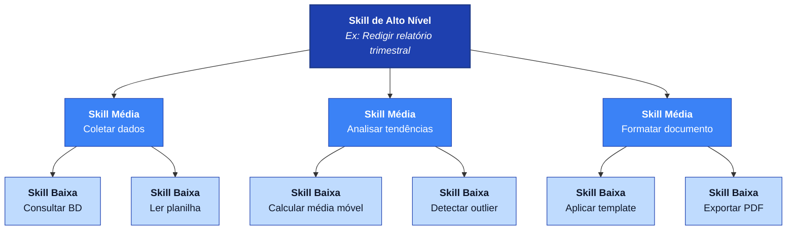
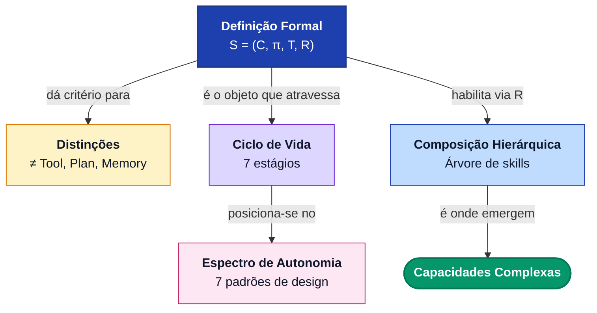

# Mapa Conceitual — Skill Engineering

> Material didático para quem cria skills, usa agentes e quer entender a arquitetura teórica por trás do campo.
> Baseado no SoK de Jiang et al.

---

## 1. Visão Geral — Mindmap

Este mindmap mostra o conceito central (**Skill**) e seus quatro eixos de compreensão: o que é, o que não é, como vive e como se compõe.

---

## 2. Anatomia da Skill — A Quádrupla S = (C, π, T, R)

O coração da definição. Cada componente responde a uma pergunta distinta.

---

## 3. Diferenciação Conceitual — Skill vs. Tool vs. Plan vs. Memory

A definição de skill importa porque separa de três conceitos frequentemente confundidos com ela.

---

## 4. Ciclo de Vida — Os 7 Estágios

A skill não é estática. Ela nasce, amadurece, é usada, avaliada e atualizada.

**Leitura rápida de cada estágio:**

| Estágio | O que acontece |
|---|---|
| **1. Descoberta** | Identificar uma capacidade candidata a virar skill |
| **2. Prática** | Exercitar a capacidade em contexto real |
| **3. Destilação** | Extrair o padrão reutilizável da prática |
| **4. Armazenamento** | Persistir a skill num repositório acessível |
| **5. Composição** | Combinar com outras skills para formar capacidades maiores |
| **6. Avaliação** | Medir eficácia, custo, taxa de sucesso |
| **7. Atualização** | Refinar, substituir ou aposentar a skill |

---

## 5. Espectro de Autonomia — Os 7 Padrões de Design

Quem controla a skill? Varia de controle humano total até meta-skills que geram outras skills.

> **Ponto-chave:** o espectro tem 7 padrões, não apenas 3. Os extremos são ilustrativos — a maior parte do design real vive no meio.

---

## 6. Composição Hierárquica — Onde a arquitetura ganha poder

Esta é a ideia central operacional: **skills se compõem em árvore**. Capacidades complexas emergem de capacidades simples reutilizáveis.

**Por que a hierarquia não é decorativa:**

- Skills de baixo nível são **reutilizadas** por múltiplas skills de nível médio
- Mudar uma skill de baixo nível propaga melhoria para todas que a invocam
- Novas capacidades de alto nível são montadas sem reescrever a base
- A árvore é o mecanismo real de **acúmulo de capacidade** no agente

---

## 7. Síntese — Como tudo se conecta

---

## Como usar este arquivo

- **Obsidian / Notion / GitHub**: cole o conteúdo diretamente — todos renderizam Mermaid nativamente.
- **VSCode**: instale a extensão *Markdown Preview Mermaid Support*.
- **Exportar para Excalidraw**: cole qualquer bloco Mermaid em [mermaid-to-excalidraw](https://mermaid-to-excalidraw.vercel.app/).
- **Slides**: os diagramas 2, 4, 5 e 6 funcionam isolados como slides individuais.

---

*Fonte conceitual: Jiang et al., SoK on Skill Engineering.*
